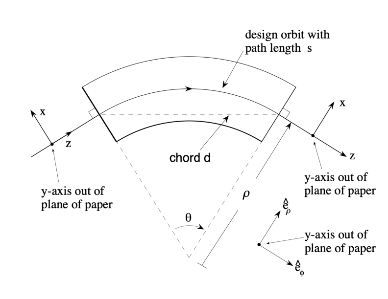
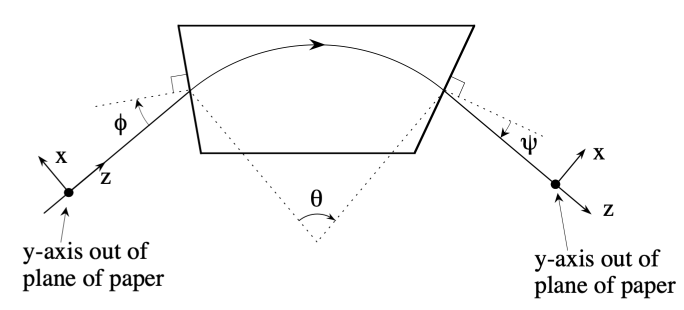

.. _theory-bending-elements:

Models of Bending Elements
===========================

There are several models relevant to the modeling of bending (dipole) elements available in ImpactX.  The models include:

* **Sbend** - linear model of a sector bend (using a symplectic matrix)
* **ExactSbend** - fully nonlinear model of a sector bend (using a nonlinear symplectic map)
* **CFbend** - linear model of a combined-function bend (using a symplectic matrix)
* **ExactCFbend** - fully nonlinear model of a combined-function bend (using symplectic integration)
* **DipEdge** - model of a dipole entry or exit fringe field (both linear and nonlinear models available)
* **ThinDipole** - thin kick model of a sector bend (using a nonlinear symplectic map)

To clarify the model input parameters, the figures below illustrate the basic dipole geometry.

   (Upper) Geometry of a basic sector bend.  (Lower) Geometry of a general bend with non-normal entry and exit angles.  These figures are excerpts from the MaryLie Manual, Figs. 6.2.1 and
   6.4.1, respectively.

Bending is assumed to occur in the x-z plane.  A positive bend angle :math:`theta` and positive radius of curvature :math:`\rho` corresponds to bending in the -x direction (clockwise about the
vertical y-axis).

The effects of non-normal pole face entry and exit, along with other dipole fringe field effects, are applied using the DipEdge element.
