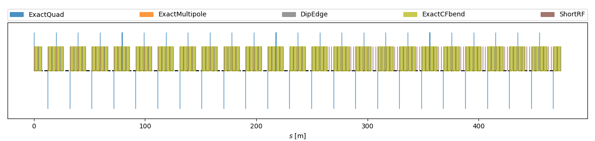

.. _examples-fodo:

Simple Booster
==============

Simplified model of the Fermilab Booster with 24 cells and 22 RF cavities.
The initial total voltage at injection is 200 KV and the Booster operated
a harmonic number of 84.

The Booster is a 474.202 m long rapid cycling synchrotron built in 1969-71
designed to rapidly accelerate
protons from a kinetic energy of 0.8 GeV to 8 GeV although this example
just runs at the injection energy.
The architecture of the accelerator is a modified FODO design and is usually
described as "FOFDOOD" which results from splitting the F and D magnets in two,
then elongating the space between the two D magnets.
The F and D magnets combine both bending and
focussing(defocussing) functions to economomize on space which is quite limited.

The lattice is read from the file 'booster_impactx_lattice.py' which is
based on the original MAD-X file sbbooster-cooked-rfon.madx.

The matched Twiss parameters determined by both Synergia and MAD-X at entry are:

* :math:`\beta_\mathrm{x} = 33.73645362843065243` m
* :math:`\alpha_\mathrm{x} = -0.01.298673960026007664`
* :math:`\beta_\mathrm{y} =  5.252517912567207681` m
* :math:`\alpha_\mathrm{y} = 0.006089861210659328755`
* :math:`\mathrm{D}_\mathrm{x} = 3.785167992` m
* :math:`\mathrm{Dp}_\mathrm{x} = 0.001377568703`

The initial beam parameters follow the PIP-II Booster beam at injection
as described in the Conceptual Design
Report. The beam consists of protons at kinetic energy 800 MeV with emittances
specified as:

+------------------------+--------------------------------------+
| :math:`\epsilon_{x}`   | :math:`16 \pi` mm-mr normalized 95%  |
+------------------------+--------------------------------------+
| :math:`\epsilon_{y}`   | :math:`16 \pi` mm-mr normalized 95%  |
+------------------------+--------------------------------------+
| :math:`\epsilon_{L}`   | 0.1 eV-s 97%                         |
+------------------------+--------------------------------------+

Run
---

This example can only be run with a python script:

* **Python** script: ``python3 run_simple_booster.py``

For `MPI-parallel <https://www.mpi-forum.org>`__ runs, prefix these lines with ``mpiexec -n 4 ...`` or ``srun -n 4 ...``, depending on the system.

.. tab-set::

   .. tab-item:: Python: Script

       .. literalinclude:: run_simple_booster.py
          :language: python3
          :caption: You can copy this file from ``examples/simple_booster/run_simple_booster.py``. The file `booster_impactx_lattice.py` from the same directory is also required.

   .. tab-item:: MAD-X: Script

       .. literalinclude:: sbbooster-cooked-rfon.madx
          :language: text
          :caption: Original MAD-X lattice file that describes the
		    simple Booster model, available at ``examples/simple_booster/sbbooster-cooked-rfon.madx``.

Analyze
-------

We run the following script to analyze correctness:

.. dropdown:: Script ``analysis_booster_simple.py``

   .. literalinclude:: analysis_simple_booster.py
      :language: python3
      :caption: You can copy this file from ``examples/fodo/analysis_booster_simple.py``.

The second moments of the transverse particle distribution after the FODO cell
should coincide with the second moments of the particle distribution
before the FODO cell, to within the level expected due to noise due to statistical sampling.

Visualize
---------

You can run the following script to visualize the beam evolution over time:

.. dropdown:: Script ``plot_simple_booster.py``

   .. literalinclude:: plot_simple_boooster.py
      :language: python3
      :caption: You can copy this file from ``examples/fodo/plot_simple_booster.py``.

.. figure:: simple_booster_sigma.png
   :alt: beam sigmas as a function of s

   Evolution of beam sigmas over two turns in the simple Booster model.

.. figure:: simple_booster_scatter.png
   :alt: Phase space evolution in the simple Booster example.

   Simple Booster initial and final phase space.

Lattice Survey
--------------

Generate a survey of the layout of the Simple Booster machine

.. dropdown:: Script ``plot_simple_booster_survey.py``

   .. literalinclude:: plot_simple_booster_survey.py
      :language: python3
      :caption: You can copy this file from ``examples/fodo/plot_simple_booster_survey.py``.

